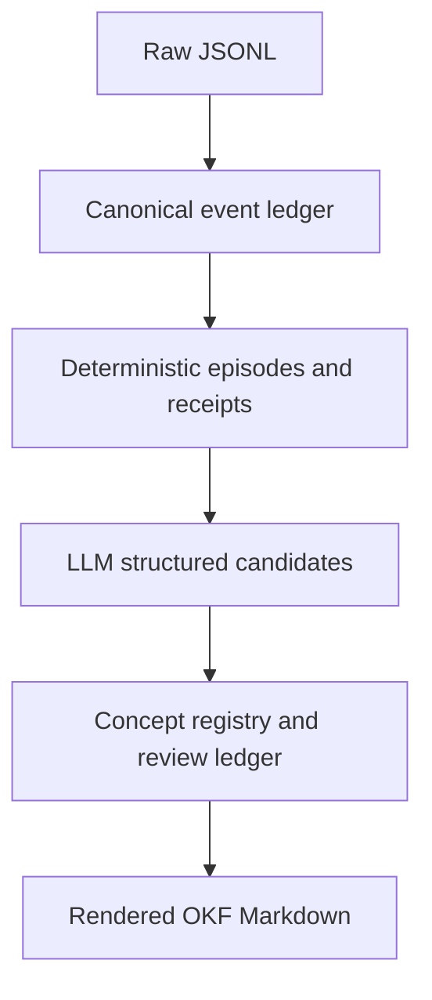

# Verdict

> **SUPERSEDED (2026-02-27):** This draft described the old `.curator/` design. The shipped design is the global-config + fire-and-forget worker in `cheatcodes-fire-and-forget-global-config-plan.md`. Kept for history only.

Yes. This is probably the cleanest version of the Knowledge Cards idea:

> Build a standalone session-to-knowledge producer that writes portable Markdown concepts. Snoop becomes one optional consumer of those files.

An agent can navigate the bundle directly through `index.md`; Snoop can ingest the same documents through its ordinary Markdown path. Neither depends on the other.

Use the current **OKF v0.2** conventions, not the original v0.1 announcement. V0.2 adds exactly what session-derived knowledge needs: sources, generation and verification metadata, lifecycle status, and freshness. It retains `index.md` for progressive disclosure and `log.md` for chronological updates. [Official OKF v0.2 specification](https://github.com/GoogleCloudPlatform/open-knowledge-format/blob/main/SPEC.md)

# 1. Reframe “cards” as knowledge concepts

A card should be an ordinary Markdown concept:

```text
knowledge/
├── index.md
├── log.md
├── decisions/
│   ├── index.md
│   └── validate-before-token-rotation.md
├── invariants/
│   ├── index.md
│   └── refresh-tokens-are-single-use.md
├── gotchas/
│   ├── index.md
│   └── validation-after-mutation-leaks-state.md
├── runbooks/
│   ├── index.md
│   └── validate-auth-changes.md
└── components/
    ├── index.md
    └── refresh-token-flow.md
```

The path becomes the stable concept identity. Normal Markdown links create relationships between concepts. Google explicitly designed OKF around producer/consumer independence: humans, agents, exporters, search indexes, and other consumers can all operate on the same directory without a required service or SDK. [Google Cloud’s OKF introduction](https://cloud.google.com/blog/products/data-analytics/how-the-open-knowledge-format-can-improve-data-sharing)

# 2. Progressive disclosure at three levels

## Level 1: Root index

An agent reads only `knowledge/index.md` initially:

```markdown
# Project knowledge

- [Decisions](decisions/) - Architectural and implementation choices.
- [Invariants](invariants/) - Rules that must remain true.
- [Gotchas](gotchas/) - Non-obvious failure modes and their resolutions.
- [Runbooks](runbooks/) - Repeatable operational and validation procedures.
- [Components](components/) - Maps of responsibilities and relationships.
```

## Level 2: Category index

The agent follows one relevant directory:

```markdown
# Authentication decisions

- [Validate before token rotation](validate-before-token-rotation.md)
  - Validation must occur before any single-use token mutation.
- [Remove the mutex-first approach](mutex-first-rejected.md)
  - Why locking did not address the underlying ordering defect.
```

Generate these indexes from concept frontmatter so descriptions cannot drift from the documents.

## Level 3: Concept document

Within each concept, put the shortest usable answer first:

```markdown
---
type: Decision
title: Validate before token rotation
description: Validate a refresh token before rotating or mutating its single-use state.
tags: [authentication, refresh-token, validation-order]
status: stable
generated:
  by: session-curator/0.1
  at: 2026-08-28T00:00:00Z
verified:
  by: human:maintainer
  at: 2026-08-28T00:00:00Z
sources:
  - id: resolution-session
    resource: session://claude/session-123#events=41-68
    title: Authentication leak investigation
  - id: implementing-commit
    resource: git://repository/commit/abc123
    title: Move validation before rotation
---

# Answer

Validate the refresh token before rotating it or changing its single-use state.

# Why

Validation after mutation allows an invalid request to change observable state before rejection.[^resolution-session]

# Rejected alternative

A mutex reduced concurrent execution but did not correct the validation ordering.

# Evidence

The final implementation moved validation before rotation.[^implementing-commit]

# Related knowledge

- [Refresh tokens are single-use](../invariants/refresh-tokens-are-single-use.md)
- [Validate authentication changes](../runbooks/validate-auth-changes.md)

[^resolution-session]: Authentication leak investigation
[^implementing-commit]: Implementing commit
```

The agent can stop after `description`, `Answer`, or `Why`, depending on how much context it needs.

# 3. Make discovery work without Snoop

Most agents will not spontaneously discover an arbitrary knowledge directory. Add a small pointer to the repository’s `AGENTS.md` or equivalent:

```markdown
## Project knowledge

Start with `knowledge/index.md`. Open only the relevant linked concepts and their evidence when needed.
```

That is enough for direct filesystem use. Snoop provides faster retrieval over the same content but is not required to interpret it.

# 4. Treat session Markdown as curation input, not knowledge

There are three distinct artifacts:

```text
Raw JSONL transcript
        ↓
Normalized session Markdown
        ↓
Curated knowledge concept
```

Do not treat all normalized session Markdown as published knowledge. That would simply convert noisy JSONL into noisy Markdown.

A clean separation would be:

```text
.curator/
└── sessions/          # Generated working views; not published or indexed

knowledge/
├── index.md           # Published bundle
├── decisions/
├── invariants/
├── gotchas/
└── runbooks/
```

The curator can deterministically render JSONL into readable Markdown containing:

* User request
* Assistant messages
* Tool calls paired with outcomes
* Files and symbols touched
* Commands and exit status
* Validation results
* Exact session/event identifiers

Only selected, durable information is promoted into `knowledge/`.

If a card requires source context that an independent agent should be able to inspect, create a narrowly scoped evidence excerpt under `knowledge/references/sessions/`. Do not copy full transcripts into the published bundle.

# 5. Snoop integration

Snoop can ingest `knowledge/**/*.md` through its normal Markdown indexer.

The most useful generic Markdown improvements would be:

* Parse YAML frontmatter
* Add `type`, `title`, `description`, `tags`, and `status` to routing metadata
* Preserve frontmatter and body provenance
* Recognize links as routing anchors
* Avoid indexing `.curator/`
* Optionally treat `index.md` as a directory map rather than ordinary detailed evidence

Those are generic OKF/Markdown capabilities, not a Knowledge Cards subsystem.

Snoop should not:

* Generate or update the concepts
* Own their verification status
* Store an alternate database representation
* Require proprietary card identifiers
* Rewrite the Markdown during indexing

# 6. Highest-value opportunities in JSONL

The best candidates are facts that are expensive to rediscover and have unusually strong evidence.

| Priority | Session pattern                                         | Published concept                     |
| -------: | ------------------------------------------------------- | ------------------------------------- |
|        1 | Failure → diagnosed cause → change → passing validation | Gotcha or resolved incident           |
|        2 | Explicit choice between alternatives                    | Decision                              |
|        3 | Attempt fails, different approach succeeds              | Rejected approach or supersession     |
|        4 | User corrects an incorrect assumption                   | Invariant, constraint, or terminology |
|        5 | Repeatable command sequence succeeds                    | Runbook                               |
|        6 | Same problem recurs across sessions                     | Gotcha or troubleshooting guide       |
|        7 | Several files jointly enforce one rule                  | Invariant or component relationship   |
|        8 | Non-obvious ownership or entry point is established     | Component map                         |

## 6.1 Resolved failure chains

This is the best low-hanging fruit because tool events provide structural evidence:

```text
command fails
→ files inspected
→ patch applied
→ command passes
→ assistant explains cause
```

Capture:

* Symptom
* Root cause
* Fix
* Validation command
* Scope
* Common misleading interpretation

A passing command alone belongs in `log.md`; the reusable cause-and-fix relationship deserves a concept.

## 6.2 Explicit decisions

Look for:

* “Use X instead of Y”
* “We decided to…”
* User acceptance of an approach
* Alternatives discussed and rejected
* A final implementation matching the decision

A plan without implementation should remain a draft. A session statement plus implementing Git evidence can become stable.

## 6.3 Failed approaches followed by successful ones

These produce especially valuable knowledge because code usually records only the final solution.

Detect:

```text
edit A
→ test fails or user rejects result
→ edit B
→ test passes or user accepts result
```

The resulting concept should explain both:

* What works
* Why the tempting alternative did not work

## 6.4 User corrections

Corrections are high-signal because they often expose project-specific knowledge absent from the repository:

* Terminology
* Business constraints
* Preferred architecture
* Files that must not change
* Expected behavior
* Known false assumptions

Do not automatically turn personal stylistic preferences into project-wide rules. Require repetition, explicit scope, or human review.

## 6.5 Successful procedures

Extract command sequences that repeatedly solve a task:

* Local test setup
* Database migration
* Fixture regeneration
* Release validation
* Authentication debugging
* Environment bootstrap

A single successful command may be accidental. Promotion becomes safer when:

* It succeeds more than once
* The user explicitly endorses it
* It appears in project documentation
* Its prerequisites are known

## 6.6 Cross-file invariants

Look for sessions where investigation shows that several files jointly enforce one behavior.

Examples:

* Producer and consumer must use the same identifier
* Validation must precede mutation across multiple entry points
* A migration and application model must change together
* Two configuration files must remain synchronized

These are more valuable than cards stating that two files contain the same symbol.

# 7. Deterministic candidate harvesting

The session curator does not need an LLM to scan every line. First identify promising episodes deterministically:

* User corrections and confirmations
* `apply_patch` or write operations
* Test/build/lint exit transitions
* Failure followed by success
* Git commits or diffs
* Reverts, renames, and deletions
* Repeated commands
* Files mentioned across multiple phases
* Final answers containing explicit cause/fix/decision language

Then give only those episodes to the human or optional curation model.

This should dramatically reduce reading volume without moving semantic generation into Snoop.

# 8. Promotion test

Before publishing a concept, require five yes answers:

1. Will this change how a future agent acts?
2. Is it expensive or error-prone to rediscover?
3. Is it more durable than the individual session?
4. Can its important claims be traced to exact evidence?
5. Is it not already clearly documented elsewhere?

If the answer to the fifth question is no, update or link the existing concept instead of creating another.

# 9. What should not become a card

Avoid publishing:

* Generic session summaries
* Lists of files touched
* One-time test results
* Unimplemented plans
* Assistant claims contradicted by tool output
* Facts trivially recoverable from current code
* Temporary task status
* Duplicate cards from separate sessions
* Commands containing secrets or credentials

Use `log.md` for noteworthy chronological events that do not justify their own durable concept.

# 10. Recommended MVP

Build a standalone `session-curator` with four operations:

```text
scan      Find high-signal JSONL episodes
review    Show normalized evidence and suggested concept type
publish   Write or update an OKF Markdown concept
reindex   Regenerate index.md and log.md
```

Start with only three concept types:

1. `Decision`
2. `Gotcha`
3. `Runbook`

Those have clearer session signals and immediate developer value. Add `Invariant` and `Supersession` after the publishing, deduplication, provenance, and review workflows are working.

The key product boundary is:

> JSONL is episodic evidence. Markdown concepts are durable knowledge. Snoop indexes the result but does not own the transformation.
# Verdict

The [project structure proposal](sandbox:/workspace/scratch/a7ba2830b031/upload/Pasted markdown(6).md) is directionally correct. Keep the central boundary:

> Session JSONL is episodic evidence. Curated Markdown is durable knowledge. Snoop is only a consumer.

The main architectural change I recommend is making `knowledge/` a generated view of persistent curation state. If the Markdown collection is the only stored result, deleting it forces the LLM to rediscover identities, deduplication, verification state, and wording. That will drift.

## 1. Project structure review

The choice of OKF v0.2 is appropriate. The current specification confirms that the file path is the concept ID, `index.md` and `log.md` are reserved generated views, and provenance, generation, verification, and lifecycle metadata belong in frontmatter. [Official OKF v0.2 specification](https://github.com/GoogleCloudPlatform/open-knowledge-format/blob/main/SPEC.md)

I would change these parts:

| Current idea                                 | Recommended change                                                         | Reason                                                       |
| -------------------------------------------- | -------------------------------------------------------------------------- | ------------------------------------------------------------ |
| Path is generated from the title             | Include a stable, non-LLM key in the path                                  | A wording change must not rename the concept                 |
| Markdown is the only curated representation  | Store a structured concept record and render Markdown                      | Enables exact regeneration                                   |
| `.curator/sessions/*.md` as normalized input | Use canonical JSONL internally; generate readable Markdown only for review | Markdown loses tool linkage and structured metadata          |
| `generated.at` uses the rebuild time         | Preserve the original meaningful-change time                               | Otherwise every rebuild changes every document               |
| `log.md` is appended during publishing       | Rebuild it from the concept event ledger                                   | Prevents duplicate entries and ordering drift                |
| `session://...` provenance                   | Link to a portable, narrow evidence excerpt                                | Consumers cannot necessarily resolve a private session URI   |
| Automatic concepts become `stable`           | Default them to `draft` until verified                                     | OKF treats absent status as stable                           |
| Filename is the identity                     | Use something like `watch-reattach-backfill--c7f3a91.md`                   | The readable slug may change while the suffix remains stable |

Also add `okf_version: "0.2"` to the root `index.md`. The specification permits that frontmatter only on the bundle-root index.

## 2. What the JSONL files show

Across the six files, I found:

| Signal                          |                             Observed volume | Recommended treatment                            |
| ------------------------------- | ------------------------------------------: | ------------------------------------------------ |
| Total records                   |                7,123, approximately 29.5 MB | Stream line by line                              |
| Message records                 |                                       6,715 | Canonical conversation spine                     |
| User messages                   |                                          99 | Only 15 are substantive                          |
| `Continue workflow...` messages |                                          75 | Episode markers, not user knowledge              |
| Run-completion prompts          |                                           5 | Orchestration noise                              |
| Assistant completed outputs     |           94, approximately 142K characters | Strong candidate summaries                       |
| Assistant reasoning             |               approximately 5.3M characters | Exclude completely                               |
| Tool-result text                |              approximately 9.76M characters | Convert to receipts; retrieve excerpts on demand |
| Custom records                  |              approximately 6.46M characters | Mostly derived or repeated state                 |
| `workflow_transition` calls     | 189, approximately 655K argument characters | High-value structured seeds                      |
| Tool calls/results              |                               3,612 / 3,611 | Link by `toolCallId`; tolerate incomplete calls  |

All record IDs were unique, timestamps were monotonic, parent references were complete, and the message chains were linear. That makes these particular files straightforward, although the parser should still support branches.

### High-value record types

Use these first:

1. Substantive human requests and corrections.
2. Accepted `workflow_transition` checkpoints.
3. `choreograph-events`, especially node completion, waiting, and rework events.
4. Assistant messages with `stopReason: "stop"`.
5. Successful mutations followed by meaningful validation.
6. Failure followed by a changed approach and later success.
7. Exact source excerpts explicitly cited by a candidate.

Use only as hints:

* Agentic context-manager summaries
* Compaction summaries
* Choreograph snapshots
* Assistant narration before tool calls

Exclude from model input by default:

* Assistant `thinking`
* Repeated complete workflow snapshots
* Entire file-read outputs
* Routine directory listings
* Failed guessed-path reads
* Full command output without candidate relevance

One especially useful optimization is that accepted `workflow_transition` calls already contain `summary`, `evidence`, `decisions`, `unknowns`, verdicts, and structured checkpoint data. They can seed candidate detection. They must still be checked against raw tool evidence because some attempts are rejected, weakened, or superseded.

## 3. Recommended processing pipeline



### Stage 1: Normalize deterministically

For each record:

* Preserve the original record ID, parent ID, timestamp, and source-file digest.
* Pair tool calls and results through `toolCallId`.
* Normalize paths to `repo://<project-id>/...`.
* Store large contents by hash rather than repeating them.
* Redact credentials before anything reaches the model.
* Preserve unknown record types for forward compatibility.

Do not identify projects solely by `cwd`. These files cover four scopes: `~/.pi`, Snoop, Choreograph, and RoastMyHarness. Choreograph also moved directories during a session. Prefer a configured repository ID or normalized Git remote identity.

### Stage 2: Segment into episodes

Use this priority:

1. `choreograph-events` node boundaries when available.
2. `Continue workflow <run> at <node>` messages.
3. Accepted `workflow_transition` results.
4. Ordinary substantive user-turn boundaries.

Retain rework attempts separately. A failed first conclusion and corrected second conclusion is often the best source for a gotcha.

### Stage 3: Generate deterministic receipts

Examples:

* `read`: path, offset, content hash, cited excerpt IDs.
* `edit`: path, before/after hashes, changed symbols, compact diff.
* `write`: path, content hash, document purpose.
* `bash`: normalized command, classification, tool error status, output hash, extracted test counts.
* `workflow_transition`: node, status, accepted/rejected, decisions, evidence, verdicts.

Do not assume `isError: false` means every shell subcommand passed. Pipelines, semicolons, and `|| true` can mask failures. Distinguish “tool invocation succeeded” from “validation confirmed.”

### Stage 4: Deterministically harvest candidate packets

A packet sent to the LLM should contain only:

* Project identity and episode label
* Substantive user intent
* Latest accepted checkpoint
* Completed assistant summary
* Relevant mutation and validation receipts
* Candidate-specific evidence excerpts
* A shortlist of possibly related existing concepts

This reduces the first-pass material for these files from roughly 29.5 MB to under 1 MB before candidate-specific evidence retrieval. Process packets individually or in small batches rather than submitting a whole session.

Use compact Markdown for model input because it is less verbose than deeply nested JSON. Require strict JSON-schema output.

## 4. Reproducible identities

IDs must never depend on LLM prose.

For example:

```text
episode_id  = hash(project_id, session_id, first_record_id, last_record_id)
evidence_id = hash(source_digest, record_ids, content_hashes)
candidate_id = hash(detector_name, ordered_evidence_ids, stable_anchors)
```

Stable anchors can include:

* Repository-relative paths
* Symbols
* Commands
* Test names
* Workflow run and node
* User-authored terminology

The model should produce structured fields such as `answer`, `cause`, `fix`, `validation`, and `rejected_alternatives`. It should not generate the concept ID, filename, timestamps, source IDs, or lifecycle state.

Deduplication should shortlist concepts deterministically using type, paths, symbols, and normalized terms. The LLM can then classify each pair as:

* Same concept
* Extends
* Supersedes
* Conflicts
* Unrelated

Persist that classification in a review ledger so it does not have to be rediscovered on every run.

## 5. Revised storage layout

```text
.curator/
├── config.yaml
├── inputs/
│   └── manifest.jsonl
├── normalized/
│   └── <session-id>.jsonl
├── episodes/
│   └── <episode-id>.json
├── evidence/
│   └── <evidence-id>.json
├── candidates/
│   └── <candidate-id>.json
├── concepts/
│   └── <concept-id>.json
├── decisions.jsonl
└── llm-cache/
    └── <request-hash>.json

knowledge/
├── index.md
├── log.md
├── decisions/
├── gotchas/
├── runbooks/
└── references/
    └── sessions/
```

`knowledge/` is portable and consumer-independent. `.curator/` is producer state.

Any Markdown evidence file under `references/` should itself have valid OKF frontmatter, typically `type: Reference`.

## 6. Strong card candidates visible in these sessions

The extraction strategy would likely identify examples such as:

* Gotcha: KDE service-menu files must be executable; mode `644` caused the “not authorized” error, and no reboot was needed.
* Gotcha: Oversized Git evidence units must be split before ranking because a unit larger than the budget is unrecoverable at every rank.
* Invariant: Script input bindings must survive through `processSpecOf` and reach the process explicitly.
* Gotcha/invariant: Per-flip trial enrichment is insufficient when attaching to an existing run; already-completed cells require backfill.
* Decision: Watch-card statistics are keyed per `(task, variant)` and persist through the final state.

Conversely, “293 tests passed,” a list of touched files, or a workflow node merely completing belongs in evidence or `log.md`, not its own concept.

## 7. MVP implementation order

1. Streaming JSONL adapter and schema fixtures.
2. Project identity and path normalization.
3. Tool-call/result pairing.
4. Episode segmentation.
5. Mutation, validation, correction, and rework detectors.
6. Compact evidence-packet renderer.
7. Strict candidate-output schema.
8. Persistent concept and decision registry.
9. Deterministic OKF renderer and index generator.
10. Golden rebuild tests using these six files.

The critical acceptance test should generate the collection, hash it, delete `knowledge/`, regenerate it, and require an identical tree hash. A separate cold-rebuild test should compare concept IDs, evidence IDs, duplicate rate, and normalized claims rather than raw wording.
